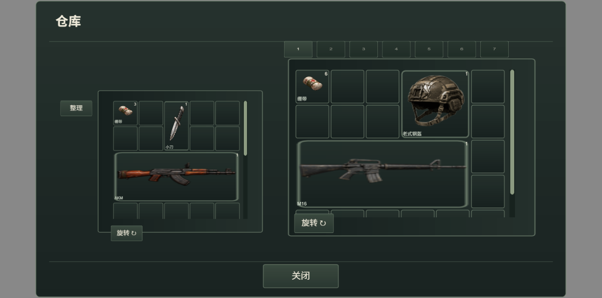
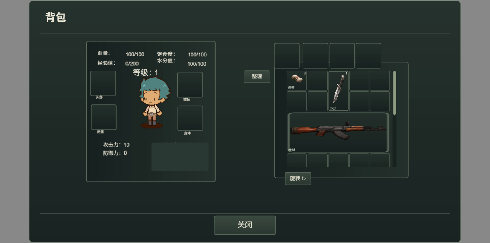

# 多格背包与仓库：第一档

背包和仓库按物品实际占格摆放，支持拖拽、旋转、双向转移和整理。保留原有界面与物品图片。

- 拖动物品到空位；绿色表示可放置，红色表示无法放置。
- 拖动中按 R 旋转，按 Esc 取消；也可以选中物品后点击“旋转”按钮。
- 空间不足、重叠或越界时保持原位置，不扣除物品。
- 在仓库窗口左右拖拽可以存入或取出，仓库仍使用原有分页。
- 点击“整理”自动合并可堆叠物品并重新摆放。

默认背包为 5 列、50 格；仓库为 6 列，每页 30 格，共 7 页。物品的 `gridWidth`、`gridHeight` 在 `assets/config/items/*.json` 配置。例如步枪为 5×2、小刀为 1×2、头盔为 2×2。容量指占用的格子数。

存档保存位置和朝向。旧存档首次载入时自动重新排布，并保留迁移前的本地备份；旧物品超出默认容量时增加恢复空间，避免丢失。迁移恢复的仓库额外格子在最后一页显示。

本档不包含包中包、胸挂分区或根据背包装备动态改变容量。

## 验证

`node tools/test-spatial-inventory.cjs` 检查边界、重叠、旋转、分页限制、堆叠、旧存档迁移、保存恢复、场景切换、快捷栏回退、精确堆转移和 500 次随机移动。

`node node_modules/typescript/bin/tsc --noEmit --pretty false` 检查项目类型。

最后复查时，项目类型检查被另一个正在修改的文件 `src/systems/BrickWallTileLayer.ts` 第 46–47 行的 3 处 `Object.values` 库兼容性错误阻塞；此次背包相关文件未报告类型错误。

独立浏览器实测通过：旋转按钮、双向拖拽、R 旋转、重叠和越界回退、Esc 取消、滚动后落位、跨仓库分页存放，以及原背包预制体显示。

手工预览场景：`assets/spatial-inventory-study/spatial-inventory-preview.ls`。使用固定测试物品并禁用该次测试运行的保存；测试完重新启动游戏运行。

# 后续更新

2026-09-21：背包和仓库界面已整体重做，仓库取消分页并连续滚动。以下为第一版的历史说明；当前布局和功能以 [tactical-inventory.md](tactical-inventory.md) 为准。
